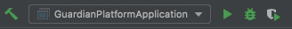
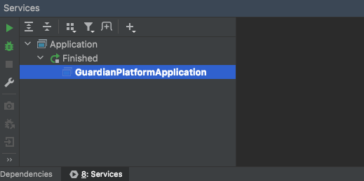

#Danusys-webservice-parent 프로젝트

### commons Library
* danusys-commons-api -> API 통신 공통 라이브러리
* danusys-commons-app -> 모든 어플래케이션의 기본 라이브러리
* danusys-commons-auth -> 인증 라이브러리
* danusys-commons-crypto -> 암호화 라이브러리
* danusys-commons-mqtt -> MQTT Client

### Application Server
* danusys-platform:8400 -> 광명 스마트시티 확산 사업(IoT 연계)
* danusys-drone:8300 -> 드론관제
* danusys-server-netty:8084 -> tcp netty 서버
* danusys-server-socket:8085 -> 소캣 서버
* danusys-smartmitering:8086 -> 스마트미터링

## 로컬 개발환경 시작하기
### 준비사항

* 개발 환경
  * Java 8 이상 설치(앞으로는 11로 가야함...)
  * maven 설치
  * 환경설정에 JAVA_HOME, MAVEN_HOME 설정
    * java -version -> 1.8 이상
    * mvn -version -> 3.x 이상
  * lombok 설치
* 개발 툴
  * Eclipse STS
  * InteliJ(권장)

---
### 소스 내려 받기 / 빌드

* 계정 만들기
  * http://172.20.5.3/users/sign_in
* git clone http://172.20.5.3/webapp/danusys-guardian-parent.git
* 전체 소스 빌드(1,2 둘중 하나만 하면 됨)
  * 방법 1 : 콘솔창 (alt + F12)
    * mvn clean install -f pom.xml -Dmaven.test.skip=true
  * 방법 2 : Maven 사이드 툴바 실행( 상단 번개모양 클릭(test skip)) > install 실행

---

### 로컬 서버 실행
* 프로퍼티 파일 내 DB 접속 정보 확인
  * application-local.properties / application-dev.properties
* Edit Configurations > Modify Options > Add VM options 항몽 추가
  * -Dspring.profiles.active=local 추가

* Run
  * 상단 네비게이션
  
  

  * 하단 탭 (alt+8)
  
  

