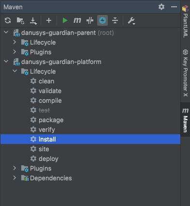
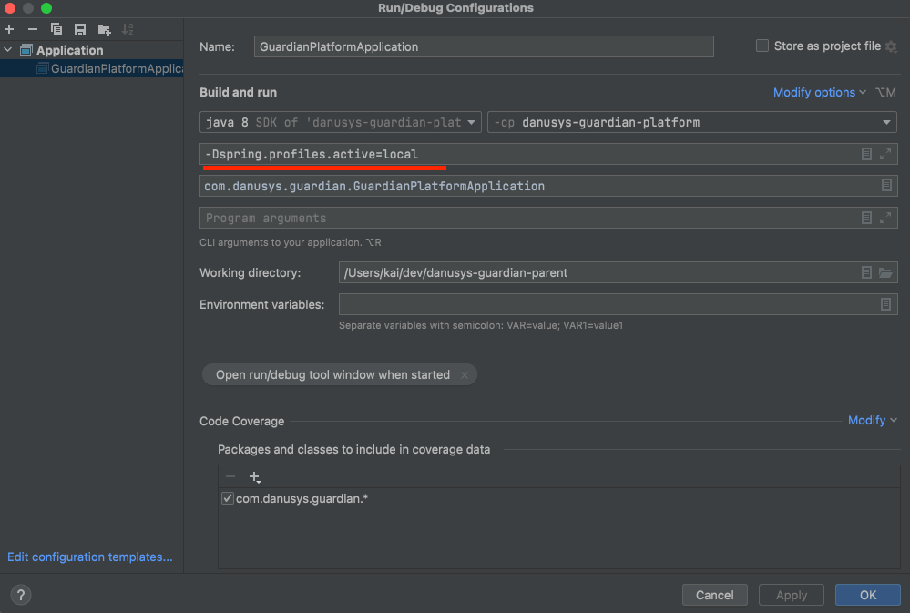

#로컬 개발 환경 시작 하기

### 준비사항

* 개발 환경
  * Java 8 이상 설치(앞으로는 11로 가야함...)
  * maven 설치
  * 환경설정에 JAVA_HOME, MAVEN_HOME 설정
    * java -version -> 1.8 이상
    * mvn -version -> 3.x 이상
  * lombok 설치
* 개발 툴
  * Eclipse STS
  * InteliJ CE(권장)

---
### 소스 내려 받기

* 계정 만들기
  * http://172.20.5.3/users/sign_in
* git clone http://172.20.5.3/webapp/danusys-guardian-parent.git
* 전체 소스 빌드
  * 콘솔창 (alt + F12)
    * mvn clean install -f pom.xml -Dmaven.test.skip=true
  * Maven 사이드 툴바 실행( 상단 번개모양 클릭(test skip)) > install 실행
  

---

### 로컬 서버 실행
* 프로퍼티 파일 내 DB 접속 정보 확인
  * application-local.properties / application-dev.properties
* Edit Configurations > Modify Options > Add VM options 항몽 추가
  * -Dspring.profiles.active=local 추가
  
